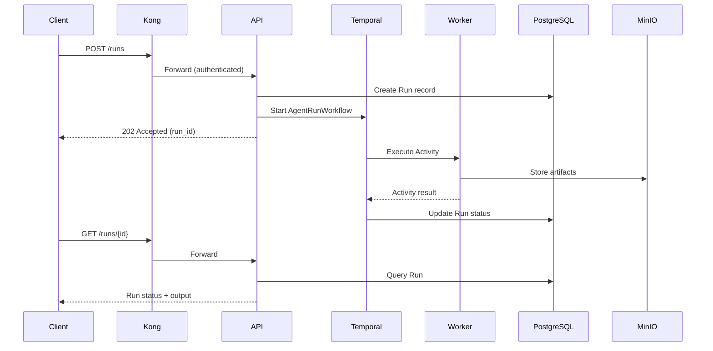

# Architecture Overview

This document describes the high-level architecture of Agent Runtime.

## System Architecture

```
                                    ┌─────────────────────────────────────────┐
                                    │              Clients                     │
                                    │  (API, CLI, UI, External Systems)        │
                                    └────────────────┬────────────────────────┘
                                                     │
                                                     ▼
┌────────────────────────────────────────────────────────────────────────────────┐
│                              Kong Gateway                                       │
│  • Routing & Load Balancing                                                    │
│  • Rate Limiting                                                               │
│  • Authentication (OIDC via Keycloak)                                          │
└────────────────────────────────────────────────────────────────────────────────┘
                                                     │
                          ┌──────────────────────────┼──────────────────────────┐
                          │                          │                          │
                          ▼                          ▼                          ▼
              ┌───────────────────┐     ┌───────────────────┐     ┌───────────────────┐
              │     Keycloak      │     │        API        │     │     LangFuse      │
              │   (Identity)      │     │  (Control Plane)  │     │ (Agent Observ.)   │
              └───────────────────┘     └─────────┬─────────┘     └───────────────────┘
                                                  │
                                                  │ Start Workflow
                                                  ▼
                                        ┌───────────────────┐
                                        │     Temporal      │
                                        │  (Orchestration)  │
                                        └─────────┬─────────┘
                                                  │
                                                  │ Dispatch Activities
                                                  ▼
                                        ┌───────────────────┐
                                        │      Worker       │
                                        │ (Execution Plane) │
                                        └─────────┬─────────┘
                                                  │
                    ┌─────────────────────────────┼─────────────────────────────┐
                    │                             │                             │
                    ▼                             ▼                             ▼
          ┌───────────────────┐       ┌───────────────────┐       ┌───────────────────┐
          │    PostgreSQL     │       │      Redis        │       │      MinIO        │
          │ (System of Record)│       │     (Cache)       │       │  (Object Store)   │
          └───────────────────┘       └───────────────────┘       └───────────────────┘
```

## Component Responsibilities

### Gateway Layer

**Kong Gateway**
- Single entry point for all API traffic
- DB-less declarative configuration for portability
- Rate limiting and request policies
- OIDC authentication integration

### Identity Layer

**Keycloak**
- OIDC/OAuth2 identity provider
- Tenant-aware authentication
- Role-based access control (admin, operator, user)
- Works offline with local database

### Control Plane

**API Service (FastAPI)**
- REST API for platform operations
- Tenant, Agent, and Run management
- Validates requests and enforces policies
- Starts Temporal workflows for runs

### Orchestration Layer

**Temporal**
- Durable workflow execution engine
- Handles retries, timeouts, and failures
- Supports pause/resume via signals
- Maintains execution state across restarts

### Execution Plane

**Worker Service**
- Executes Temporal activities
- LLM calls (OpenAI, local models)
- Tool execution
- Artifact storage operations

### Data Layer

**PostgreSQL**
- System of record for all entities
- Tenant, Agent, AgentVersion, Run tables
- Transactional consistency

**Redis**
- Ephemeral state and caching
- Rate limit counters
- Session data

**MinIO**
- S3-compatible object storage
- Run artifacts (files, outputs)
- Large inputs/outputs

### Observability

**LangFuse**
- LLM/Agent-specific observability
- Trace visualization
- Cost tracking
- Prompt analytics

## Data Flow: Creating a Run



## Deployment Modes

### Local (Docker Compose)
- All services in single docker-compose.yml
- Identical environment variables
- Suitable for development and small deployments

### AWS (ECS)
- Same container images
- Managed services where appropriate (RDS, ElastiCache)
- ECS tasks mirror Compose service definitions

## Security Model

1. **Authentication**: OIDC tokens validated by Kong → Keycloak
2. **Authorization**: Tenant isolation enforced at API layer
3. **Network**: Internal services not exposed externally
4. **Secrets**: Environment variables (Vault in production)
