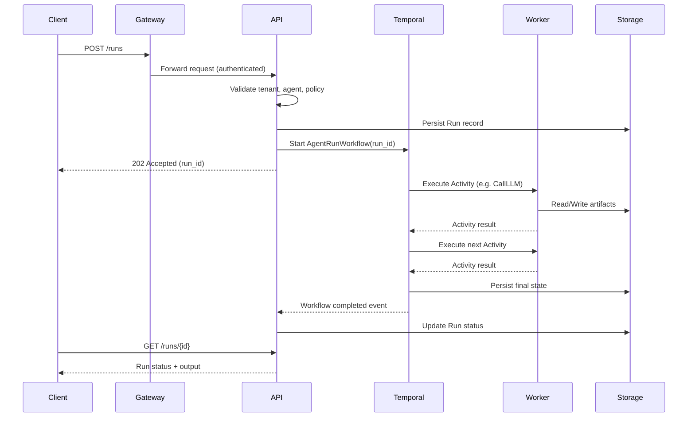

# MVP Run Sequence Diagram

The following diagram illustrates the end-to-end flow of a single Agent Run in the MVP platform.

```mermaid
sequenceDiagram
    participant Client
    participant Gateway
    participant API
    participant Temporal
    participant Worker
    participant Storage

    Client->>Gateway: POST /runs
    Gateway->>API: Forward request (authenticated)
    API->>API: Validate tenant, agent, policy
    API->>Storage: Persist Run record
    API->>Temporal: Start AgentRunWorkflow(run_id)
    API-->>Client: 202 Accepted (run_id)

    Temporal->>Worker: Execute Activity (e.g. CallLLM)
    Worker->>Storage: Read/Write artifacts
    Worker-->>Temporal: Activity result

    Temporal->>Worker: Execute next Activity
    Worker-->>Temporal: Activity result

    Temporal->>Storage: Persist final state
    Temporal-->>API: Workflow completed event
    API->>Storage: Update Run status

    Client->>API: GET /runs/{id}
    API-->>Client: Run status + output
```
